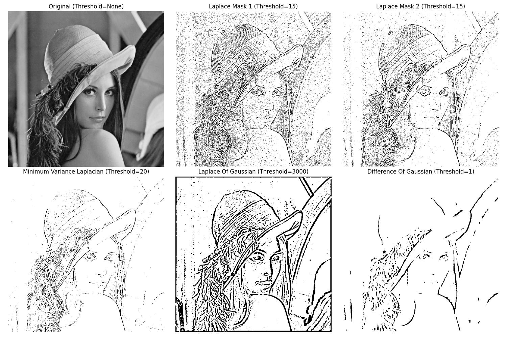

# Computer Vision Homework 10

NTU CSIE D13922014 黃丰楷

## Results

</img>

## (a) **Laplace Mask1 (0, 1, 0, 1, -4, 1, 0, 1, 0)**

- Description
    
    The `laplace_mask1` function applies edge detection using a Laplace operator with a 3x3 kernel, where the center pixel has a weight of -4 and the adjacent pixels have a weight of 1.
    
    
- Code
    
    ```python
    def laplace_mask1(self):
        kernel = np.array([
            [0, 1, 0],
            [1, -4, 1],
            [0, 1, 0]
        ])
        laplace_img = self.convolution2d(self.original_img, kernel)
        return self.binarize(laplace_img, 15)
    ```
    
<!-- - Result

    </img> -->

## (b)  **Laplace Mask2 (1, 1, 1, 1, -8, 1, 1, 1, 1)**

- Description
    
    The `laplace_mask2` function performs edge detection using a Laplace operator. It applies a 3x3 kernel with values emphasizing the central pixel (set to -8) and its neighbors (set to 1), normalized by dividing by 3. 
    
- Code
    
    ```python
    def laplace_mask2(self):
        kernel = np.array([
            [1., 1, 1],
            [1, -8, 1],
            [1, 1, 1]
        ]) / 3
        laplace_img = self.convolution2d(self.original_img, kernel)
        return self.binarize(laplace_img, 15)
    ```
    
<!-- - Result

    </img> -->

## (c) Minimum variance Laplacian

- Description
    
    The `minimum_variance_laplacian` function performs edge detection using a Laplacian operator designed to minimize variance. The kernel is a 3x3 matrix with values that emphasize the central pixel with -4 and the adjacent pixels with a weight of -1 or 2.
  
    
- Code
    
    ```python
    def minimum_variance_laplacian(self):
        kernel = np.array([
            [2., -1, 2],
            [-1, -4, -1],
            [2, -1, 2]
        ]) / 3
        laplace_img = self.convolution2d(self.original_img, kernel)
        return self.binarize(laplace_img, 20)
    ```
    
<!-- - Result

    </img> -->

## (d) Laplace of Gaussian

- Description
    
   The `laplace_of_gaussian` function is an edge detection technique that combines Gaussian smoothing with the Laplace operator to identify edges in an image. This implementation defines a specialized 11x11 kernel with carefully crafted weights that simultaneously blur the image and detect edges by emphasizing rapid intensity changes. The function applies this kernel through a custom convolution method to the original image and then binarizes the result with a high threshold of 3000, effectively highlighting strong edge features while suppressing noise and less significant intensity transitions.
    
- Code

  ```python
  def laplace_of_gaussian(self):
          kernel = np.array([
              [0, 0, 0, -1, -1, -2, -1, -1, 0, 0, 0],
              [0, 0, -2, -4, -8, -9, -8, -4, -2, 0, 0],
              [0, -2, -7, -15, -22, -23, -22, -15, -7, -2, 0],
              [-1, -4, -15, -24, -14, -1, -14, -24, -15, -4, -1],
              [-1, -8, -22, -14, 52, 103, 52, -14, -22, -8, -1],
              [-2, -9, -23, -1, 103, 178, 103, -1, -23, -9, -2],
              [-1, -8, -22, -14, 52, 103, 52, -14, -22, -8, -1],
              [-1, -4, -15, -24, -14, -1, -14, -24, -15, -4, -1],
              [0, -2, -7, -15, -22, -23, -22, -15, -7, -2, 0],
              [0, 0, -2, -4, -8, -9, -8, -4, -2, 0, 0],
              [0, 0, 0, -1, -1, -2, -1, -1, 0, 0, 0]
          ])
          laplace_img = self.convolution2d(self.original_img, kernel)
          return self.binarize(laplace_img, 3000)
  ```

<!-- - Result

    </img> -->

## (e) Difference of Gaussian

- Description
    
    The `difference_of_gaussian` function is an edge detection technique that uses a specialized 11x11 kernel to highlight image edges by computing the difference between two Gaussian-blurred versions of an image. This implementation creates a kernel with asymmetric negative and positive weights that emphasize edge transitions by comparing local intensity variations. The function applies the kernel through a custom convolution method to the original image and then binarizes the result with a low threshold of 1, effectively identifying and enhancing subtle edge features across the image.

- Code


  ```python
  def difference_of_gaussian(self):
          kernel = np.array([
              [-1, -3, -4, -6, -7, -8, -7, -6, -4, -3, -1],
              [-3, -5, -8, -11, -13, -13, -13, -11, -8, -5, -3],
              [-4, -8, -12, -16, -17, -17, -17, -16, -12, -8, -4],
              [-6, -11, -16, -16, 0, 15, 0, -16, -16, -11, -6],
              [-7, -13, -17, 0, 85, 160, 85, 0, -17, -13, -7],
              [-8, -13, -17, 15, 160, 283, 160, 15, -17, -13, -8],
              [-7, -13, -17, 0, 85, 160, 85, 0, -17, -13, -7],
              [-6, -11, -16, -16, 0, 15, 0, -16, -16, -11, -6],
              [-4, -8, -12, -16, -17, -17, -17, -16, -12, -8, -4],
              [-3, -5, -8, -11, -13, -13, -13, -11, -8, -5, -3],
              [-1, -3, -4, -6, -7, -8, -7, -6, -4, -3, -1],
          ])
          dog_img = self.convolution2d(self.original_img, kernel)
          return self.binarize(dog_img, 1, False)
  ```
<!-- 
- Result

    </img> -->

## Additional Implementation

- Description
    
    For convenience, the 2D convolution and binarization functions are implemented
    
- Code
    

  ```python
  def convolution2d(self, img, kernel):
          img_height, img_width = img.shape
          ker_height, ker_width = kernel.shape
          
          pad_h = ker_height // 2
          pad_w = ker_width // 2
          padded_img = np.pad(img, ((pad_h, pad_h), (pad_w, pad_w)), mode='constant')
          
          output = np.zeros_like(img)
          
          for i in range(img_height):
              for j in range(img_width):
                  local_region = padded_img[i:i+ker_height, j:j+ker_width]
                  
                  output[i, j] = np.sum(local_region * kernel)
          
          return output

  def binarize(self, img, thr, is_lower=True):
          img_bin = np.zeros_like(img)
          if is_lower:
              img_bin[img < thr] = 255
          else:
              img_bin[img >= thr] = 255
          return img_bin
  ```
<!-- 
- Result

  </img> -->

