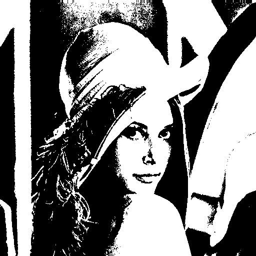
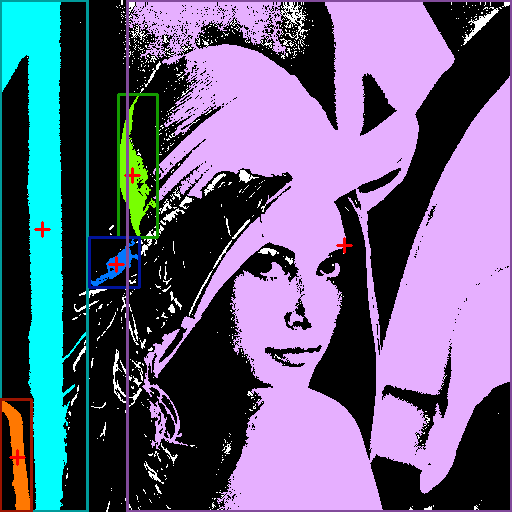

# Computer Vision Homework 2

NTU CSIE D13922014 黃丰楷

## (a) Binary image (threshold at 128)

- Description
    
    I define a function `binarize` that converts an image into a binary (black and white) format based on a threshold. The input `img` is a 2D array (grayscale image) where each pixel value ranges from 0 to 255. The function creates a copy of the image `b`, then iterates through each pixel. If the pixel value is greater than or equal to 128, it sets the value to 255 (white); otherwise, it sets the value to 0 (black). The result is a binarized image where all pixel values are either 0 or 255. 
    
- Code
    
    ```python
    def binarize(img):
        b = img.copy()
        for i in range(b.shape[0]):
            for j in range(b.shape[1]):
                if b[i,j] >= 128:
                    b[i,j] = 255
                else:
                    b[i,j] = 0
        return b
    binarized_img = binarize(img)
    ```
    
- Result
    
    </img>
    

## (b) Histogram

- Description
    
    I define a function `histogram` that generates the histogram of an image. The input `img` is a grayscale image where pixel values range from 0 to 255. The function initializes a zero-filled array `his` of length 256 (one for each possible pixel value). It then iterates through each pixel in the image, incrementing the corresponding index in `his` based on the pixel's value. This results in `his` storing the frequency of each pixel value in the image. After calculating the histogram, the code uses `plt.bar` to create a bar chart of the pixel frequencies and saves the plot as an image file using `plt.savefig`.
    
- Code
    
    ```python
    def histogram(img):
        his = np.zeros(256)
        for i in range(img.shape[0]):
            for j in range(img.shape[1]):
                his[img[i,j]] += 1
        return his
    his = histogram(img)
    ```
    
- Result
    
    </img>
    

## (c) Connected components(regions with + at centroid,bounding box)

- Description
    
    The code identifies 4-connected components in a binary image using the two-pass algorithm. In the first pass, the `scan` function assigns provisional labels to each pixel based on its neighboring pixels. If no neighbors are labeled, a new label is created, and if multiple neighbors have labels, the `union` function is used to mark them as equivalent. The `union` function maintains a `parent` dictionary, where each label points to its root label, and uses rank to keep the label tree balanced. The `find` function retrieves the root label for each pixel, compressing paths for efficiency. In the second pass, each pixel’s label is replaced with its root label from the `parent` dictionary to ensure consistent labeling. The `two_pass` function then applies colors to the distinct components and filters out small components. The `find_mean_and_box` function calculates the centroid and bounding box of each component. The final output image shows colored components with crosshairs at their centroids and rectangles around their bounding boxes.
    
- Code
    
    ```python
    def find(parent, i):
        if i not in parent:
            return i
        if parent[i] != i:
            parent[i] = find(parent, parent[i])
        return parent[i]

    def union(parent, rank, x, y):
        xroot = find(parent, x)
        yroot = find(parent, y)
        if xroot != yroot:
            if xroot not in rank:
                rank[xroot] = 0
            if yroot not in rank:
                rank[yroot] = 0
            
            if rank[xroot] < rank[yroot]:
                parent[xroot] = yroot
            elif rank[xroot] > rank[yroot]:
                parent[yroot] = xroot
            else:
                parent[yroot] = xroot
                rank[xroot] += 1

    def unique(arr):
        unique_set = set()
        for value in arr.flat: 
            if value != 0: 
                unique_set.add(value)
        return sorted(list(unique_set))

    def scan(img):
        height, width = img.shape
        labels = np.zeros((height, width), dtype=np.int32)
        next_label = 1
        parent = {}
        rank = {}

        # First pass
        for y in range(height):
            for x in range(width):
                if img[y, x] == 0:  
                    continue
                neighbors = []
                if y > 0 and labels[y-1, x] != 0:
                    neighbors.append(labels[y-1, x])
                if x > 0 and labels[y, x-1] != 0:
                    neighbors.append(labels[y, x-1])

                if not neighbors:
                    labels[y, x] = next_label
                    parent[next_label] = next_label
                    rank[next_label] = 0
                    next_label += 1
                else:
                    min_label = min(neighbors)
                    labels[y, x] = min_label
                    for neighbor_label in neighbors:
                        if neighbor_label != min_label:
                            union(parent, rank, min_label, neighbor_label)
        # Second pass
        for y in range(height):
            for x in range(width):
                if labels[y, x] != 0:
                    labels[y, x] = find(parent, labels[y, x])
        return labels

    def two_pass(img, colors):
        labels = scan(img)
        out_img = cv2.cvtColor(img[:], cv2.COLOR_GRAY2BGR)
        for key in unique(labels):
            if len(labels[labels == key]) < 500:
                labels[labels == key] = 0
        unique_labels = unique(labels)
        relabel_dict = {old_label: new_label for new_label, old_label in enumerate(unique_labels, start=1)}
        for y in range(labels.shape[0]):
            for x in range(labels.shape[1]):
                if labels[y, x] != 0:
                    labels[y, x] = relabel_dict[labels[y, x]]
        colors = np.array(colors)
        color_img = colors[labels]
        color_img[color_img == 0] = out_img[ color_img == 0]
        
        return color_img, labels

    def find_mean_and_box(labels):
        info = {}
        for l in unique(labels):
            if l == 0:
                continue
            coord = []
            for i in range(labels.shape[0]):
                for j in range(labels.shape[1]):
                    if labels[i,j] == l:
                        coord.append([i,j])
            coord = np.array(coord)
            m = [int(np.mean(coord[:,1])),int(np.mean(coord[:,0]))]
            x_min, y_min = min(coord[:,1]), min(coord[:,0])
            x_max, y_max = max(coord[:,1]), max(coord[:,0])
            info[l] = [m, (x_min, y_min), (x_max,y_max)]
        
        return info

    colors = [[0, 0, 0], [255, 255, 1], [1, 255, 120], [255, 120, 1], [255, 175, 230], [1, 120, 255]]
    four_cc_img, labels = two_pass(binarized_img, colors)
    info = find_mean_and_box(labels)
    four_cc_img = four_cc_img.astype(np.uint8)
    print(four_cc_img.shape)
    for k, l in info.items():
        print(colors[k])
        cv2.line(four_cc_img, (l[0][0] - 7, l[0][1]), (l[0][0] + 7, l[0][1]), [0, 0, 255], 2)
        cv2.line(four_cc_img, (l[0][0], l[0][1] - 7), (l[0][0], l[0][1] + 7), [0, 0, 255], 2)
        cv2.rectangle(four_cc_img, l[1],l[2], [colors[k][0]-100, colors[k][1]-100, colors[k][2]-100], 2)
    ```
    
- Result
    
    </img>
