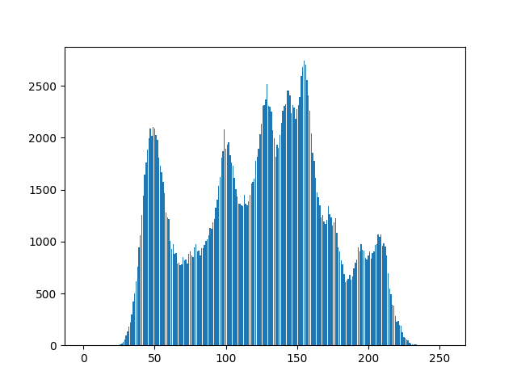
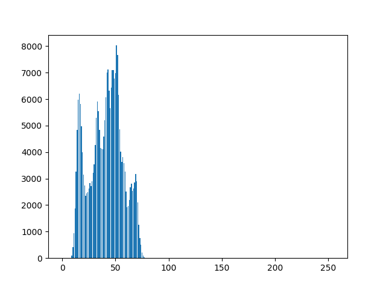
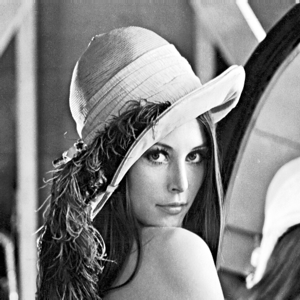
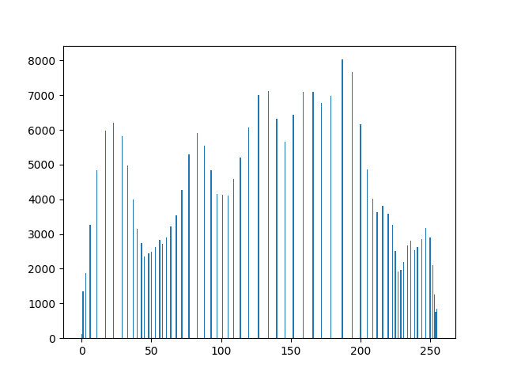

# Computer Vision Homework 3

NTU CSIE D13922014 黃丰楷

## (a) Original image and its histogram

- Description
    
    I define a function `histogram` that generates the histogram of an image. The input `img` is a grayscale image where pixel values range from 0 to 255. The function initializes a zero-filled array `his` of length 256 (one for each possible pixel value). It then iterates through each pixel in the image, incrementing the corresponding index in `his` based on the pixel's value. This results in `his` storing the frequency of each pixel value in the image. After calculating the histogram, the code uses `plt.bar` to create a bar chart of the pixel frequencies and saves the plot as an image file using `plt.savefig`.
    
- Code
    
    ```python
    def histogram(im):
        his = np.zeros(256)
        for i in range(im.shape[0]):
            for j in range(im.shape[1]):
                his[im[i,j]] += 1
        return his
    his = histogram(img)
    cv2.imwrite('./output/ori_img.png',cv2.cvtColor(img.copy(), cv2.COLOR_GRAY2BGR))
    plt.bar(np.arange(his.shape[0]), his)
    plt.savefig('./output/histogram.png')
    ```
    
- Result
    
    </img>   </img>
    

## (b)  Image with intensity divided by 3 and its histogram

- Description
    
    I copied the input image and divided its intensity values by 3, reducing its brightness. Then, I  computed its histogram. I saved the modified image as `divided_img.png` after converting it to BGR format and plotted the histogram using `plt.bar()`, which I saved as `divided_histogram.png`.
    
- Code
    
    ```python
    divided_img = img.copy()//3
    divided_his = histogram(divided_img)
    cv2.imwrite('./output/divided_img.png',cv2.cvtColor(divided_img.copy(), cv2.COLOR_GRAY2BGR))
    plt.bar(np.arange(divided_his.shape[0]), divided_his)
    plt.savefig('./output/divided_histogram.png')
    ```
    
- Result

    </img>   </img>

## (c) Image after applying histogram equalization to (b) and its histogram

- Description
    
    I first calculated the Probability Density Function (PDF) of the divided image histogram by normalizing it with the image size. Then, I computed the Cumulative Distribution Function (CDF) using a loop to accumulate the PDF values. The CDF was scaled to a range of 0-255, and I used it to remap the pixel intensities in the image to perform histogram equalization. I updated the histogram to reflect the new equalized intensity values (new_PDF). Finally, I saved the equalized image as `eq_img.png` and the new histogram as `eq_histogram.png`.
    
- Code
    
    ```python
    PDF = divided_his / (divided_img.shape[0]*divided_img.shape[1])
    CDF = np.zeros_like(PDF)
    CDF[0] = PDF[0]
    for i in range(1,len(CDF)):
        CDF[i] = CDF[i-1] + PDF[i]
    CDF = np.round(CDF*255)
    new_PDF = np.zeros_like(PDF)
    eq_img = divided_img.copy()
    for idx, value in enumerate(CDF):
        new_PDF[int(value)] += PDF[idx]
        eq_img[np.where(divided_img==idx)] = value
    new_PDF *= (divided_img.shape[0]*divided_img.shape[1])
    cv2.imwrite('./output/eq_img.png',cv2.cvtColor(eq_img.copy(), cv2.COLOR_GRAY2BGR))
    plt.bar(np.arange(new_PDF.shape[0]), new_PDF)
    plt.savefig('./output/eq_histogram.png')
    ```
    
- Result
    
    
    </img>   </img>