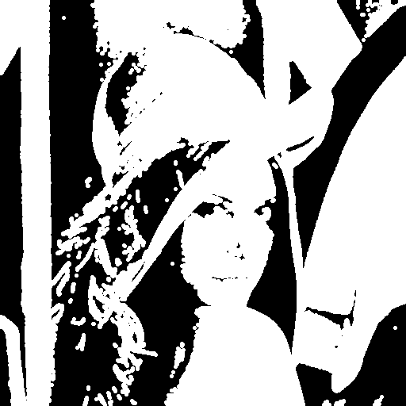
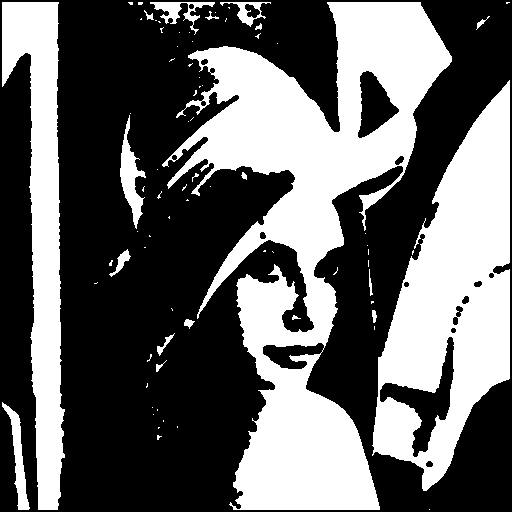
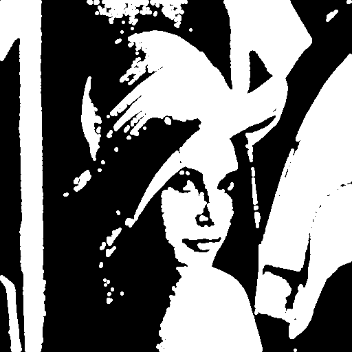
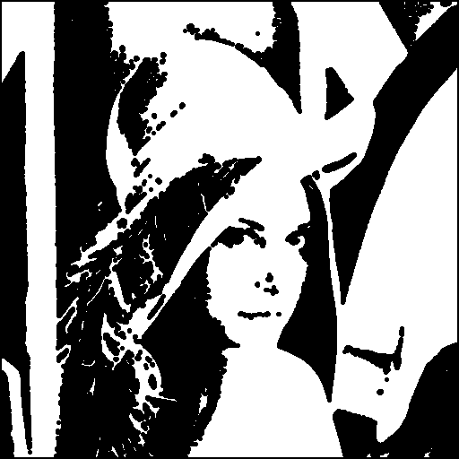
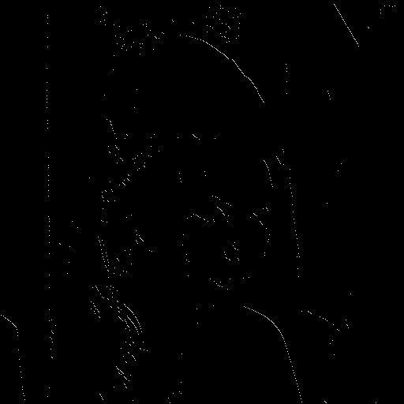

# Computer Vision Homework 4

NTU CSIE D13922014 黃丰楷

## (a) **Dilation**

- Description
    
    I implemented a dilation function that uses an octagonal 3-5-5-5-3 kernel. The function iterates through each pixel in the input image (`img`). If a pixel has a positive intensity, the function checks its neighbors defined by the kernel. If there is any neighbor within the image boundaries that greater than 0, it assigns a value of 255 to the corresponding position in `img_temp`. The result is a dilated version of the image, with expanded bright regions based on the octagonal kernel.
    
- Code
    
    ```python
    def dilation(img, kernel):
        img_temp = np.zeros(img.shape)
        for i in range(img.shape[0]):
            for j in range(img.shape[1]):
                if img[i][j] > 0:
                    for (k, l) in kernel:
                        i_d = i + k
                        j_d = j + l
                        if i_d >= 0 and j_d >= 0 \
                            and i_d <= (img.shape[0]-1) and j_d <= (img.shape[1]-1):
                            img_temp[i_d][j_d] = 255
        
        return img_temp
    ```
    
- Result

    </img>

## (b)  **Erosion**

- Description
    
    I implemented an erosion function using an octagonal 3-5-5-5-3 kernel. For each pixel in the input image (`img`), the function checks if all neighboring pixels defined by the kernel have positive intensity. If any neighbor falls outside the image boundary or has zero intensity, the pixel is not drawn (set to 0). If all conditions are met, the pixel in `img_temp` is set to 255. This process shrinks bright regions in the image, resulting in an eroded version.
    
- Code
    
    ```python
    def erosion(img, kernel):
        img_temp = np.zeros(img.shape)
        for i in range(img.shape[0]):
            for j in range(img.shape[1]):
                draw = True
                for (k, l) in kernel:
                    i_d = i + k
                    j_d = j + l
                    if i_d < 0 or j_d < 0 \
                        or i_d > (img.shape[0]-1) or j_d > (img.shape[1]-1) \
                        or img[i_d][j_d] <= 0:
                        draw = False
                        break
                if draw:
                    img_temp[i][j] = 255
        
        return img_temp
    ```
    
- Result

    </img>

## (c) Opening

- Description
    
    I implemented a opening function, which can be formulated as $B\circ K=(B \ominus J) \oplus K$.   
    
- Code
    
    ```python
    def opening(img, kernel):
        return dilation(erosion(img_bin, kernel), kernel)
    ```
    
- Result

    </img>

# (d) Closing

- Description
    
    I implemented a closing function, which can be formulated as   $B\bullet K=(B \oplus J) \ominus K$.
    

```python
def closing(img, kernel):
    return erosion(dilation(img_bin, kernel), kernel)
```

- Result

    </img>


# (d) **Hit-and-miss transform**

- Description
    
    I implemented a hit-and-miss transformation function, which can be formulated as $A\otimes (J,K)=(A \ominus J) \cap (A^C\ominus K)$. First, I defined the `J_kernel` and `K_kernel`. Then, I created an inverted version of the input image (`img_comp`) by subtracting `img` from 255. Using the `erosion` function, I applied `J_kernel` to the original image and `K_kernel` to the complement. Finally, I checked for overlapping pixels between the two eroded images (`img_j` and `img_k`), setting corresponding pixels in `img_temp` to 255 where both conditions were met. This yields the hit-and-miss transformation result.
    
- Code
    
    ```python
    def h_and_m(img):
        J_kernel = [[0, -1], [0, 0], [1, 0]]
        K_kernel = [[-1, 0], [-1, 1], [0, 1]]
    
        img_comp = -img + 255
        img_j = erosion(img, J_kernel)
        img_k = erosion(img_comp, K_kernel)
        img_temp = np.zeros(img.shape)
        for i in range(img.shape[0]):
            for j in range(img.shape[1]):
                if img_j[i][j] > 0 and img_k[i][j] > 0:
                    img_temp[i][j] = 255
    
        return img_temp
    ```
    
- Result

    </img>
