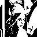
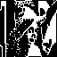
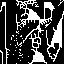
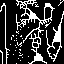
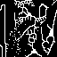
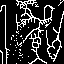
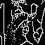

# Computer Vision Homework 7

NTU CSIE D13922014 黃丰楷

## **Thinning**
This code performs iterative thinning on a binary, downsampled image of Lena through three main operations: Yokoi Connectivity Number Calculation, Pair Relationship Marking, and Connected Shrinkage. The process is outlined as follows:

- Iterative Thinning Process:
    
    Each iteration calculates the Yokoi connectivity number for each pixel to assess its structural connectivity, marks pixels based on pair relationships to identify essential pixels, and applies connected shrinkage to remove non-essential pixels while maintaining connectivity. The process repeats until convergence, yielding a skeletal image.

- Function Descriptions:
    
    - **Yokoi Connectivity Number Calculation** (`yokoi_transform`):
    Calculates the connectivity pattern of each pixel using four neighboring regions. Pixels receive a connectivity number, with “5” indicating a fully connected pixel and lower values indicating fewer connections.
    ```python
    def yokoi_transform(img):
        def h(b, c, d, e):
            if b == c and (d != b or e != b):
                return "q"
            if b == c and (d == b and e == b):
                return "r"
            return "s"

        def yokoi_number(img, i, j):
            x0 = img[i, j]
            x1 = img[i, j + 1] if j + 1 < img.shape[1] else 0
            x2 = img[i - 1, j] if i - 1 >= 0 else 0
            x3 = img[i, j - 1] if j - 1 >= 0 else 0
            x4 = img[i + 1, j] if i + 1 < img.shape[0] else 0
            x5 = img[i + 1, j + 1] if i + 1 < img.shape[0] and j + 1 < img.shape[1] else 0
            x6 = img[i - 1, j + 1] if i - 1 >= 0 and j + 1 < img.shape[1] else 0
            x7 = img[i - 1, j - 1] if i - 1 >= 0 and j - 1 >= 0 else 0
            x8 = img[i + 1, j - 1] if i + 1 < img.shape[0] and j - 1 >= 0 else 0

            a1 = h(x0, x1, x6, x2)
            a2 = h(x0, x2, x7, x3)
            a3 = h(x0, x3, x8, x4)
            a4 = h(x0, x4, x5, x1)

            if a1 == 'r' and a2 == 'r' and a3 == 'r' and a4 == 'r':
                return 5
            else:
                return sum([a == 'q' for a in [a1, a2, a3, a4]])
            
        output_matrix = np.zeros(img.shape)

        for i in range(img.shape[0]):
            for j in range(img.shape[1]):
                if img[i, j] > 0:  
                    output_matrix[i, j] = yokoi_number(img, i, j)
        return output_matrix
    ```
    - **Pair Relationship Marking** (`mark_pair_relationship`):
    Identifies pixels for removal by labeling “p” (1) for removable pixels and “q” (2) for essential ones, preserving critical structural points.
    ```python
    def mark_pair_relationship(img, yokoi_img):
        def pair_relationship(yokoi_img, i, j):
            if yokoi_img[i, j] != 1:
                return 2
            
            has_p_neighbor = any(
                0 <= ni < yokoi_img.shape[0] and 0 <= nj < yokoi_img.shape[1] and yokoi_img[ni, nj] == 1
                for ni, nj in [(i, j + 1), (i - 1, j), (i, j - 1), (i + 1, j)]
            )
            return 1 if has_p_neighbor else 2

        output = np.zeros_like(yokoi_img, dtype=int)
        for i in range(yokoi_img.shape[0]):
            for j in range(yokoi_img.shape[1]):
                if img[i, j] > 0:
                    output[i, j] = pair_relationship(yokoi_img, i, j)
        return output
    ```
    - **Connected Shrinkage** (`connected_shrink_operator`):
    Conditionally removes "p"-labeled pixels based on neighboring connections, ensuring connectivity. Pixels with only one surrounding "1" are removed; otherwise, they are retained.
    ```python
    def connected_shrink_operator(img, img_pair):
        def h_cs(b, c, d, e):
            return 1 if b == c and (d != b or e != b) else 0

        def f_cs(a1, a2, a3, a4, x0):
            return 0 if sum([a1, a2, a3, a4]) == 1 else x0

        def connected_shrink(img, i, j):
            x0 = img[i, j]
            x1 = img[i, j + 1] if j + 1 < img.shape[1] else 0  # right
            x2 = img[i - 1, j] if i - 1 >= 0 else 0                # top
            x3 = img[i, j - 1] if j - 1 >= 0 else 0                # left
            x4 = img[i + 1, j] if i + 1 < img.shape[0] else 0  # bottom
            x5 = img[i + 1, j + 1] if i + 1 < img.shape[0] and j + 1 < img.shape[1] else 0  # bottom-right
            x6 = img[i - 1, j + 1] if i - 1 >= 0 and j + 1 < img.shape[1] else 0                # top-right
            x7 = img[i - 1, j - 1] if i - 1 >= 0 and j - 1 >= 0 else 0                              # top-left
            x8 = img[i + 1, j - 1] if i + 1 < img.shape[0] and j - 1 >= 0 else 0                # bottom-left

          
            a1 = h_cs(x0, x1, x6, x2)
            a2 = h_cs(x0, x2, x7, x3)
            a3 = h_cs(x0, x3, x8, x4)
            a4 = h_cs(x0, x4, x5, x1)

            return f_cs(a1, a2, a3, a4, x0)
    ```
    

- Result
    - Each iteration

        </img>(iter=0)
        </img>(iter=1)
        </img>(iter=2)
        </img>(iter=3)

        </img>(iter=4)
        </img>(iter=5)
        </img>(iter=6) 
        </img>(iter=7) 
    - Final (enlarged)

        </img> 


        

    

