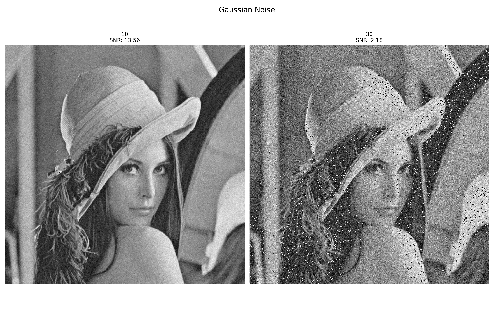
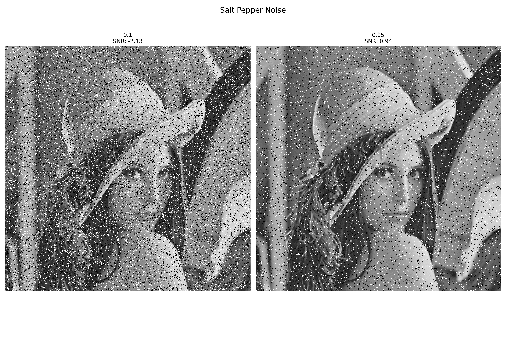
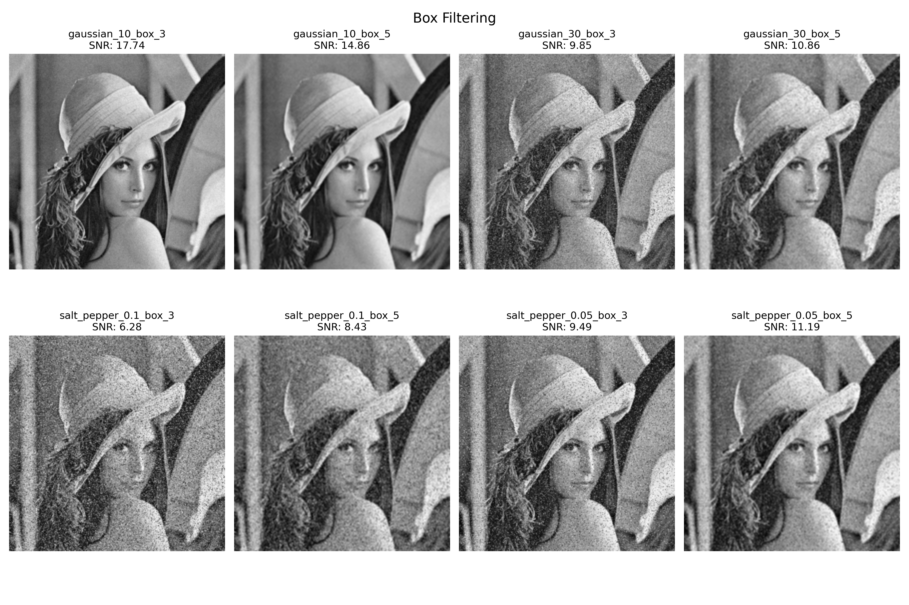
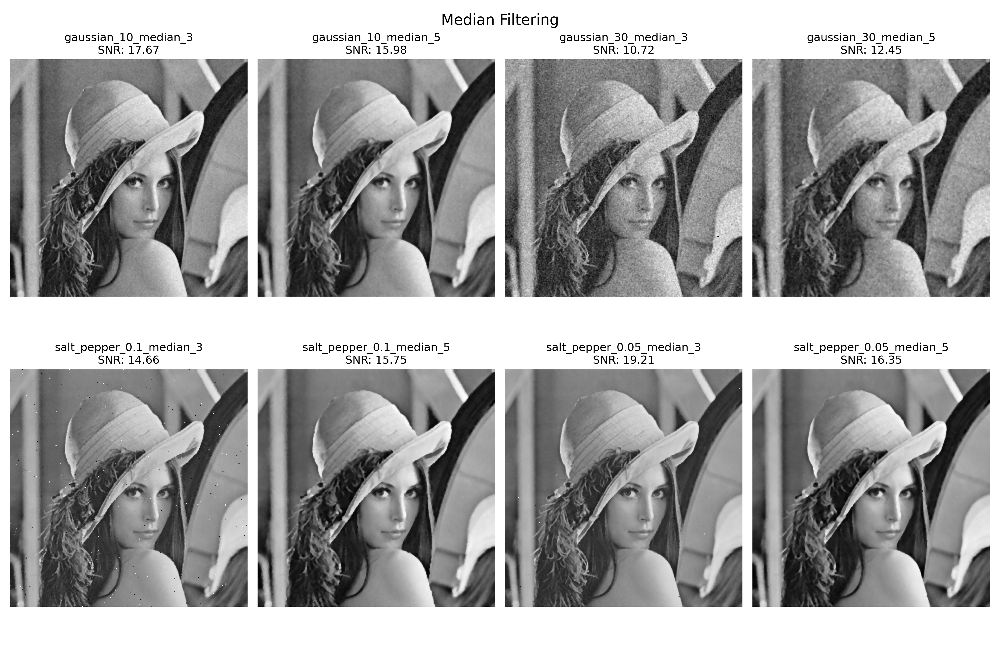
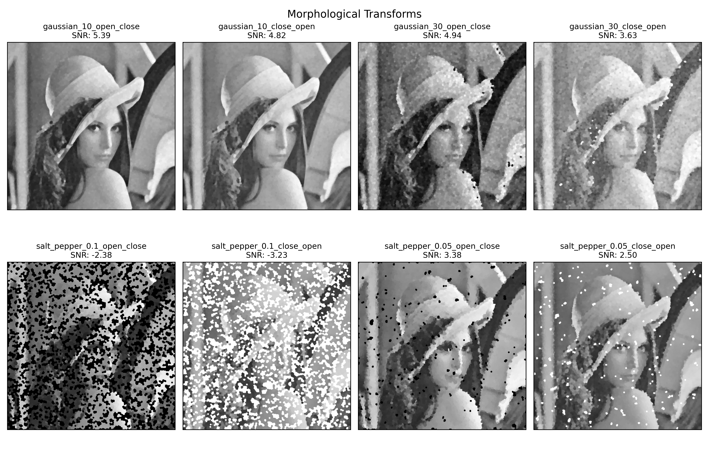

# Computer Vision Homework 8

NTU CSIE D13922014 黃丰楷

## (a) **Generate noisy images with gaussian noise(amplitude of 10 and 30)**

- Description
    
    For Gaussian noise, it generates random values from a normal distribution, scaled by an `amplitude` parameter (default: `10`), and adds them to the image, ensuring the result stays within the valid range of pixel values (`uint8`). 
    
    
- Code
    
    ```python
    if noise_type == 'gaussian':
        amplitude = params.get('amplitude', 10)
        noise = amplitude * np.random.normal(0, 1, self.image.shape)
        return (self.image.astype(float) + noise).astype(np.uint8)
    ```
    
- Result

    </img>

## (b)  **Generate noisy images with salt-and-pepper noise( probability 0.1 and 0.05)**

- Description
    
    For salt-and-pepper noise, it uses a random mask to set a fraction of pixels to either black (`0`) or white (`255`), controlled by a `threshold` parameter (default: `0.1`).
    
    
- Code
    
    ```python
    elif noise_type == 'salt_pepper':
            threshold = params.get('threshold', 0.1)
            noisy = self.image.copy()
            mask = np.random.uniform(0, 1, self.image.shape)
            h, w = self.image.shape
            for i in range(h):
                for j in range(w):
                    if mask[i, j] < threshold:
                        noisy[i, j] = 0
                    elif mask[i, j] > 1 - threshold: 
                        noisy[i, j] = 255
            
            return noisy
    ```
    
- Result

    </img>

## (c) Use the 3x3, 5x5 box filter on images generated by (a)(b)

- Description
    
    The `_box_filter` function applies a box filter to an image. It first determines the image's height (`h`) and width (`w`) and initializes an output array of the same size filled with zeros. To handle boundary pixels, the input image is padded using a helper `padding` function, with the padding size calculated as half of the kernel size (`pad = kernel_size // 2`). For each pixel in the original image, the function computes the mean of the pixel values within a sliding kernel of size `kernel_size × kernel_size` centered on that pixel. The filtered values are stored in the output image, which is then converted back to `uint8` format and returned. This filter is commonly used for image smoothing by averaging local regions.
    
- Code
    
    ```python
    def _box_filter(self, image, kernel_size):
        h, w = image.shape
        output = np.zeros_like(image)
        pad = kernel_size // 2
        padded = self.padding(image, pad, mode='edge')
        
        for i in range(h):
            for j in range(w):
                output[i,j] = padded[i:i+kernel_size, j:j+kernel_size].mean()
        
        return output.astype(np.uint8)
    ```
    
- Result

    </img>

## (d) Use 3x3, 5x5 median filter on images generated by (a)(b)

- Description
    
    The `_median_filter` function implements a median filter for image processing, which is effective at reducing noise while preserving edges. The function starts by determining the height (`h`) and width (`w`) of the input image and initializes an output array of the same size. To handle edge cases, it pads the input image using the `padding` function, with the padding size calculated as half the kernel size (`pad = kernel_size // 2`). For each pixel in the original image, it extracts the pixel values within a `kernel_size × kernel_size` neighborhood from the padded image, calculates the median of these values using a helper method `median`, and assigns the result to the corresponding pixel in the output image. The final output is converted to the `uint8` format before returning. This filter is commonly used for denoising images with impulsive noise, such as salt-and-pepper noise.
    

```python
def _median_filter(self, image, kernel_size):
        h, w = image.shape
        output = np.zeros_like(image)
        pad = kernel_size // 2
        padded = self.padding(image, pad, mode='edge')
        
        for i in range(h):
            for j in range(w):
                output[i,j] = self.median(padded[i:i+kernel_size, j:j+kernel_size])
        
        return output.astype(np.uint8)
```

- Result

    </img>

## (e) Use both opening-then-closing and closing-then opening filter (using the octogonal 3-5-5-5-3 kernel, value = 0) on images generated by (a)(b)

- Description
    
    This code snippet defines the morphological_transform function to apply morphological operations, specifically opening-then-closing or closing-then-opening, on an image using a specified kernel. The provided kernel represents an octagonal shape (3-5-5-5-3 configuration), suitable for morphological operations. The `opening` and `closing` functions are defined in `HW5`.
    
    

```python
def morphological_transform(self, image, transform_type='open_close'):
        kernel = np.array([[-2, -1], [-2, 0], [-2, 1],
                   [-1, -2], [-1, -1], [-1, 0], [-1, 1], [-1, 2],
                   [0, -2], [0, -1], [0, 0], [0, 1], [0, 2],
                   [1, -2], [1, -1], [1, 0], [1, 1], [1, 2],
                   [2, -1], [2, 0], [2, 1]])
        
        def opening(img, kernel):
            return dilation(erosion(img, kernel), kernel)
        def closing(img, kernel):
            return erosion(dilation(img, kernel), kernel)
        
        if transform_type == 'open_close':
            opened = opening(image, kernel)
            return closing(opened, kernel).astype(np.uint8)
        else:
            closed = closing(image, kernel)
            return opening(closed, kernel).astype(np.uint8)
```

- Result

    </img>

## Calculate the signal-to-ratio (SNR)

- Description
    
    The `calculate_snr` function computes the Signal-to-Noise Ratio (SNR) between an original image and its noisy version. It first calculates the noise by subtracting the original image from the noisy image, both converted to floating-point to ensure precision during the subtraction. Then, it computes the variance of the original signal (`original.var()`) and the variance of the noise (`noise.var()`).
    
    

```python
def calculate_snr(self, original, noisy):
      noise = noisy.astype(float) - original.astype(float)
      return np.log10(original.var()/noise.var()) * 10
```