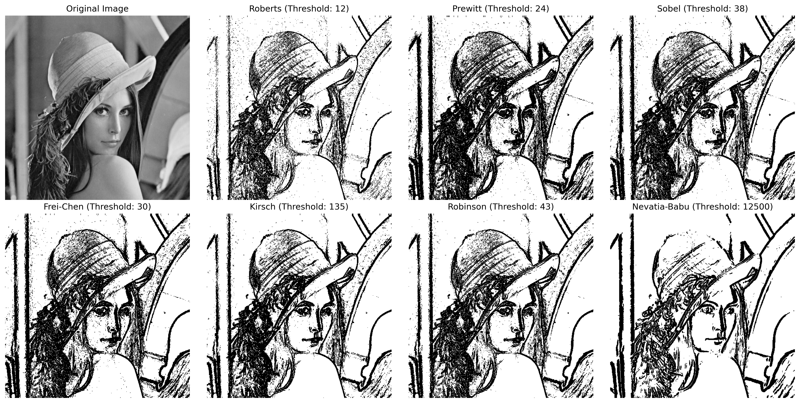
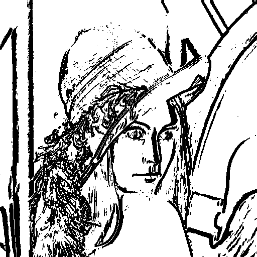

# Computer Vision Homework 9

NTU CSIE D13922014 黃丰楷

## Results

</img>

## (a) **Robert's Operator: Threshold=12**

- Description
    
    The `roberts_operator` function implements Roberts Cross Gradient Edge Detection, which detects edges by calculating the gradient magnitude at each pixel. It expands the input image to handle boundary pixels safely, then computes the gradient components (`gx` and `gy`) using diagonal differences between adjacent pixels.
    
    
- Code
    
    ```python
    def roberts_operator(self, threshold=12):
        expanded = self._expand_image(self.image_array)
        result = np.zeros_like(self.image_array)
        
        for i in range(self.height):
            for j in range(self.width):
                gx = expanded[i+1, j+1] - expanded[i+2, j+2]
                gy = expanded[i+2, j+1] - expanded[i+1, j+2]
                grad = np.sqrt(gx**2 + gy**2)
                result[i, j] = 0 if grad >= threshold else 255
        
        return result
    ```
    
<!-- - Result

    </img> -->

## (b)  **Prewitt's Edge Detector: Threshold=24**

- Description
    
    The `prewitt_operator` function applies Prewitt edge detection to an image by calculating intensity changes in the horizontal and vertical directions. It first expands the image to handle boundary pixels. For each pixel, the function computes the horizontal gradient (`gx`) by subtracting the sum of pixel values in the upper row from the lower row, and the vertical gradient (`gy`) by subtracting the sum of pixel values in the leftmost column from the rightmost column of a 3x3 region.
    
    
- Code
    
    ```python
    def prewitt_operator(self, threshold=24):
        expanded = self._expand_image(self.image_array)
        result = np.zeros_like(self.image_array)
        
        for i in range(self.height):
            for j in range(self.width):
                gx = np.sum(expanded[i+2, j:j+3]) - np.sum(expanded[i, j:j+3])
                gy = np.sum(expanded[i:i+3, j+2]) - np.sum(expanded[i:i+3, j])
                grad = np.sqrt(gx**2 + gy**2)
                result[i, j] = 0 if grad >= threshold else 255
        
        return result
    ```
    
<!-- - Result

    </img> -->

## (c) Sobel's Edge Detector: Threshold=38

- Description
    
    The `sobel_operator` function implements Sobel edge detection, which highlights edges by calculating intensity gradients using weighted convolution kernels. The image is first expanded to handle boundary pixels. For each pixel, the function computes the horizontal gradient (`gx`) and vertical gradient (`gy`) using Sobel weights, which prioritize the central rows or columns in a 3x3 region.
  
    
- Code
    
    ```python
    def sobel_operator(self, threshold=38):
        expanded = self._expand_image(self.image_array)
        result = np.zeros_like(self.image_array)
        
        for i in range(self.height):
            for j in range(self.width):
                gx = (
                    expanded[i+2, j] + 2*expanded[i+2, j+1] + expanded[i+2, j+2] -
                    (expanded[i, j] + 2*expanded[i, j+1] + expanded[i, j+2])
                )
                
                gy = (
                    expanded[i, j+2] + 2*expanded[i+1, j+2] + expanded[i+2, j+2] -
                    (expanded[i, j] + 2*expanded[i+1, j] + expanded[i+2, j])
                )
                
                grad = np.sqrt(gx**2 + gy**2)
                
                result[i, j] = 0 if grad >= threshold else 255
        
        return result
    ```
    
<!-- - Result

    </img> -->

## (d) Frei and Chen's Gradient Operator: Threshold=30

- Description
    
   The `frei_chen_operator` function implements Frei and Chen's Gradient Operator for edge detection. This method enhances edge gradients using a weighted calculation similar to Sobel but includes a $\sqrt{2}$ factor for diagonal emphasis, improving edge sensitivity. The image is expanded to handle boundary pixels. For each pixel, the horizontal (`gx`) and vertical (`gy`) gradients are computed using the Frei-Chen kernel, which applies weighted differences across a 3x3 region.
    

```python
def frei_chen_operator(self, threshold=30):
        expanded = self._expand_image(self.image_array)
        result = np.zeros_like(self.image_array)
        sqrt2 = np.sqrt(2)
        
        for i in range(self.height):
            for j in range(self.width):
                gx = (
                    expanded[i+2, j] + sqrt2*expanded[i+2, j+1] + expanded[i+2, j+2] -
                    (expanded[i, j] + sqrt2*expanded[i, j+1] + expanded[i, j+2])
                )
                
                gy = (
                    expanded[i, j+2] + sqrt2*expanded[i+1, j+2] + expanded[i+2, j+2] -
                    (expanded[i, j] + sqrt2*expanded[i+1, j] + expanded[i+2, j])
                )
                
                grad = np.sqrt(gx**2 + gy**2)
                
                result[i, j] = 0 if grad >= threshold else 255
        
        return result
```

<!-- - Result

    </img> -->

## (e) Kirsch's Compass Operator: Threshold=135

- Description
    
    The `kirsch_operator` function implements Kirsch's Compass Edge Detection, which detects edges by evaluating gradients in eight compass directions. A helper function, `kernel_operation`, computes weighted sums using a directional kernel, where certain pixel positions are emphasized with a weight of 5 (positive) or reduced with a weight of -3 (negative). The image is expanded to handle boundary pixels. For each pixel, gradients are calculated for all eight compass directions (e.g., North, Northeast, East, etc.) using different kernel configurations.


```python
def kirsch_operator(self, threshold=135):
    
        def kernel_operation(array, pos, neg):
            p = 0
            for i in pos:
                p += 5*array[i[0]][i[1]]
            for i in neg:
                p -= 3*array[i[0]][i[1]]
            
            return p

        expanded = self._expand_image(self.image_array)
        result = np.zeros_like(self.image_array)
        
        for i in range(self.height):
            for j in range(self.width):
                p1 = kernel_operation(expanded, ((i, j+2), (i+1, j+2), (i+2, j+2)), ((i, j), (i, j+1), (i+1, j), (i+2, j), (i+2, j+1)))
                p2 = kernel_operation(expanded, ((i, j), (i+1, j), (i+2, j)), ((i, j+2), (i, j+1), (i+1, j+2), (i+2, j+2), (i+2, j+1)))
                p3 = kernel_operation(expanded, ((i, j), (i, j+1), (i, j+2)), ((i+1, j), (i+2, j), (i+1, j+2), (i+2, j+2), (i+2, j+1)))
                p4 = kernel_operation(expanded, ((i+2, j), (i+2, j+1), (i+2, j+2)), ((i, j), (i+1, j), (i, j+2), (i+1, j+2), (i, j+1)))
                p5 = kernel_operation(expanded, ((i, j), (i+1, j), (i, j+1)), ((i, j+2), (i+1, j+2), (i+2, j+2), (i+2, j+1), (i+2, j)))
                p6 = kernel_operation(expanded, ((i, j+2), (i+1, j+2), (i, j+1)), ((i, j), (i+1, j), (i+2, j), (i+2, j+1), (i+2, j+2)))
                p7 = kernel_operation(expanded, ((i+2, j+2), (i+1, j+2), (i+2, j+1)), ((i, j), (i, j+1), (i+1, j), (i+2, j), (i, j+2)))
                p8 = kernel_operation(expanded, ((i+2, j), (i+1, j), (i+2, j+1)), ((i, j), (i, j+1), (i, j+2), (i+1, j+2), (i+2, j+2)))
                
                grad = max(p1, p2, p3, p4, p5, p6, p7, p8)
                
                result[i, j] = 0 if grad >= threshold else 255
        
        return result
```
<!-- 
- Result

    </img> -->

## (f) Robinson's Compass Operator: Threshold=43

- Description
    
    The `robinson_operator` function implements Robinson's Compass Edge Detection, which detects edges based on gradients in four main compass directions (North, East, South, and West). The image is expanded to handle border pixels, and the gradient is calculated for each direction using predefined kernels that assign different weights to surrounding pixels. The absolute differences between opposing sides of the kernel are summed to compute directional gradients. The maximum gradient among the four directions is selected as the final gradient for each pixel.
    
    

```python
def robinson_operator(self, threshold=43):
        expanded = self._expand_image(self.image_array)
        result = np.zeros_like(self.image_array)
        
        for i in range(self.height):
            for j in range(self.width):
                p1 = abs(
                    expanded[i][j+2] + 2*expanded[i+1][j+2] + expanded[i+2][j+2] -
                    (expanded[i][j] + 2*expanded[i+1][j] + expanded[i+2][j])
                )
                
                p3 = abs(
                    expanded[i][j] + 2*expanded[i][j+1] + expanded[i][j+2] -
                    (expanded[i+2][j] + expanded[i+2][j+2] + 2*expanded[i+2][j+1])
                )
                
                p5 = abs(
                    2*expanded[i][j] + expanded[i+1][j] + expanded[i][j+1] -
                    (expanded[i+1][j+2] + 2*expanded[i+2][j+2] + expanded[i+2][j+1])
                )
                
                p6 = abs(
                    2*expanded[i][j+2] + expanded[i+1][j+2] + expanded[i][j+1] -
                    (expanded[i+1][j] + 2*expanded[i+2][j] + expanded[i+2][j+1])
                )
                
                grad = max(p1, p3, p5, p6)
                
                result[i, j] = 0 if grad >= threshold else 255
        
        return result
```
<!-- 
- Result

  </img> -->

## (g) Nevatia-Babu 5x5 Operator: Threshold=12500

- Description
    
    The `nevatia_babu_operator` function implements the Nevatia-Babu edge detection method, designed to extract edges by analyzing gradients in six distinct orientations using a 5x5 kernel. First, the image is expanded twice to ensure all pixels can be processed within the larger kernel. For each pixel, six directional gradients (`p1` through `p6`) are computed by applying predefined weight configurations over the 5x5 region around the pixel. These weights emphasize specific orientations while penalizing opposite directions. The function then calculates the maximum gradient value among these six orientations.
    
    

```python
def nevatia_babu_operator(self, threshold=12500):
        expanded = self._expand_image(self.image_array)
        expanded = self._expand_image(expanded)

        result = np.zeros_like(self.image_array)

        for i in range(self.height):
            for j in range(self.width):
                p1 = (
                    100 * sum(expanded[i][j+k] for k in range(5)) +
                    100 * sum(expanded[i+1][j+k] for k in range(5)) -
                    100 * sum(expanded[i+3][j+k] for k in range(5)) -
                    100 * sum(expanded[i+4][j+k] for k in range(5))
                )
                
                p2 = (
                    100 * sum(expanded[i+k][j+4] for k in range(5)) +
                    100 * sum(expanded[i+k][j+3] for k in range(5)) -
                    100 * sum(expanded[i+k][j+1] for k in range(5)) -
                    100 * sum(expanded[i+k][j] for k in range(5))
                )
                
                p3 = (
                    100 * sum(expanded[i][j+k] for k in range(5)) +
                    100 * sum(expanded[i+1][j+k] for k in range(3)) +
                    100 * expanded[i+2][j] +
                    78 * expanded[i+1][j+3] +
                    92 * expanded[i+2][j+1] +
                    32 * expanded[i+3][j] -
                    100 * sum(expanded[i+4][j+k] for k in range(5)) -
                    100 * sum(expanded[i+3, j+2:j+5]) -
                    100 * expanded[i+2][j+4] -
                    78 * expanded[i+3][j+1] -
                    92 * expanded[i+2][j+3] -
                    32 * expanded[i+1][j+4]
                )
                
                p4 = (
                    100 * sum(expanded[i+k][j] for k in range(5)) +
                    100 * (expanded[i][j+1] + expanded[i+1][j+1] + expanded[i+1][j+2] +  expanded[i+2][j+2]) +
                    78 * expanded[i+3][j+1] +
                    92 * expanded[i+1][j+2] +
                    32 * expanded[i][j+3] -
                    100 * sum(expanded[i+k][j+4] for k in range(5)) -
                    100 * sum(expanded[i+2:i+5,j+3]) -
                    100 * expanded[i+4][j+2] -
                    78 * expanded[i+1][j+3] -
                    92 * expanded[i+3][j+2] -
                    32 * expanded[i+4][j+1]
                )
                
                p5 = (
                    100 * sum(expanded[i+k][j+4] for k in range(5)) +
                    100 * sum(expanded[i:i+3, j+3]) +
                    100 * expanded[i][j+2] + 
                    78 * expanded[i+3][j+3] +
                    92 * expanded[i+1][j+2] +
                    32 * expanded[i][j+1] -
                    100 * sum(expanded[i+k][j] for k in range(5)) -
                    100 * sum(expanded[i+2:i+5, j+1]) -
                    100 * expanded[i+4, j+2] -
                    78 * expanded[i+1][j+1] -
                    92 * expanded[i+3][j+2] -
                    32 * expanded[i+4][j+3]
                )
                
                p6 = (
                    100 * sum(expanded[i][j+k] for k in range(5)) +
                    100 * sum(expanded[i+1, j+2:j+5]) +
                    100 * expanded[i+2][j+4] +
                    78 * expanded[i+1][j+1] +
                    92 * expanded[i+2][j+3] +
                    32 * expanded[i+3][j+4] -
                    100 * sum(expanded[i+4][j+k] for k in range(5)) -
                    100 * sum(expanded[i+3, j:j+3]) -
                    100 * expanded[i+2][j] -
                    78 * expanded[i+3][j+3] -
                    92 * expanded[i+2][j+1] -
                    32 * expanded[i+1][j]
                )
                
                grad = max(p1, p2, p3, p4, p5, p6)
                
                result[i, j] = 0 if grad >= threshold else 255
        
        return result
```
<!-- 
- Result 
  
  </img> -->